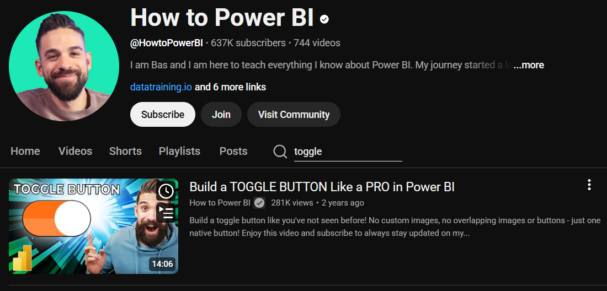
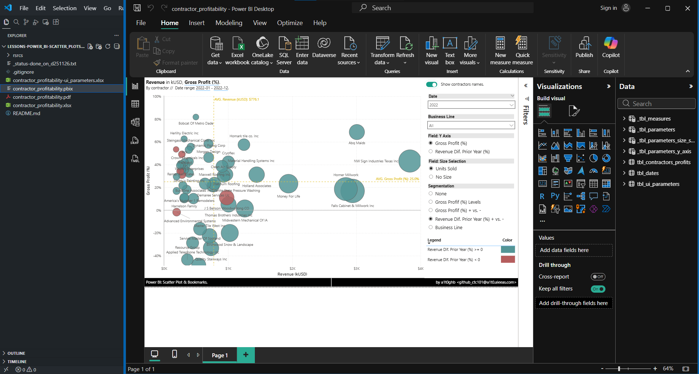
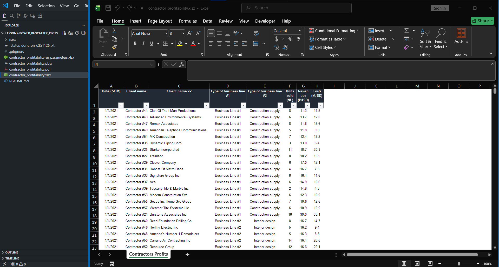
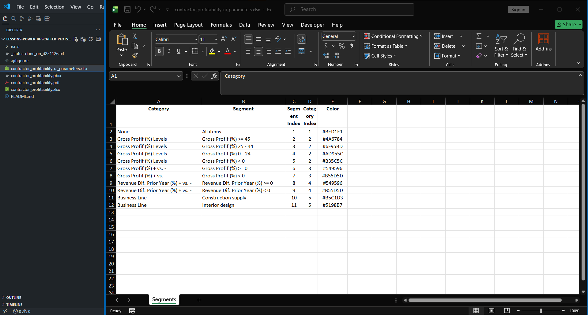
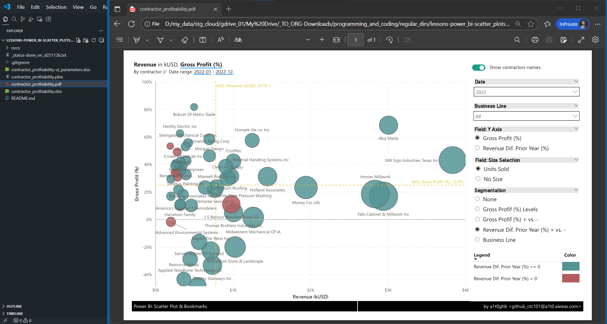
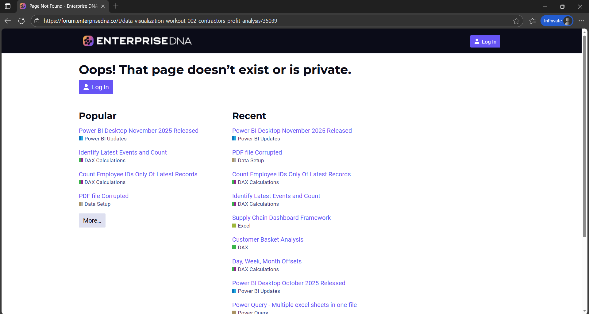
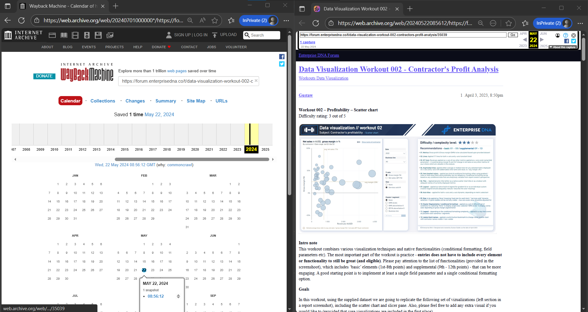
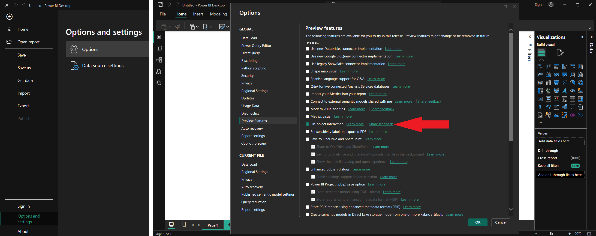
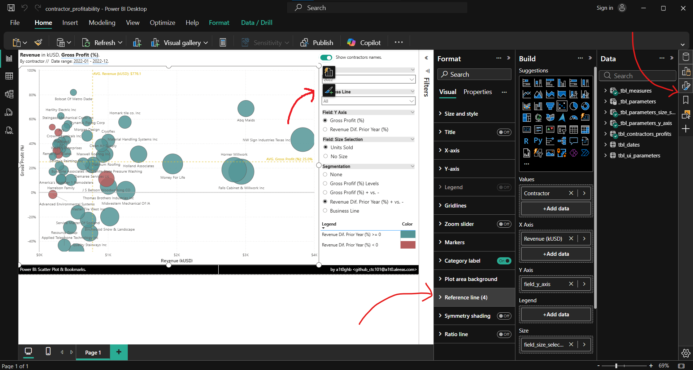
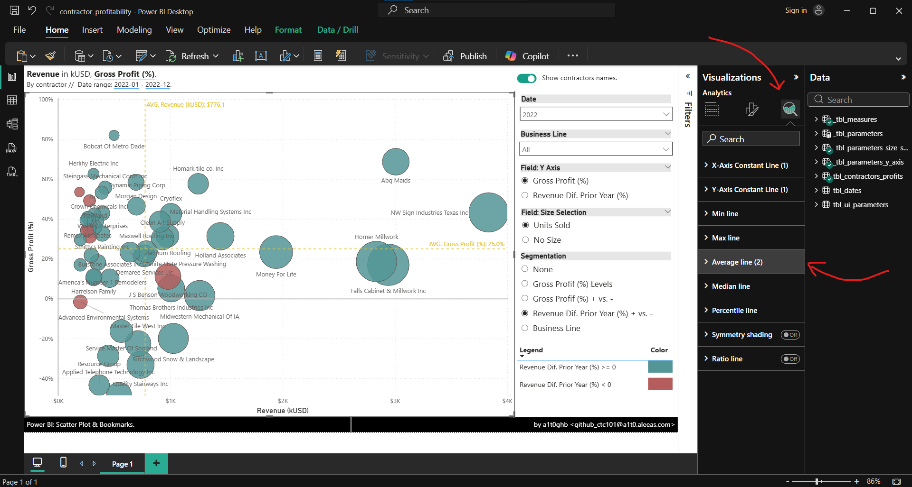

<!-- Badges:
- Source: 'https://shields.io/docs/static-badges', 'https://shields.io/badges/static-badge'.
- HTML structure followed: 'https://github.com/facebook/docusaurus/blob/main/README.md?plain=1'.
- Badges with logos: 'https://shields.io/docs/logos', 'https://simpleicons.org/', 'https://github.com/simple-icons/simple-icons/blob/master/slugs.md'.
- HTML <a> tag not redirecting: 'https://stackoverflow.com/questions/8260546/make-a-html-link-that-does-nothing-literally-nothing/8260561#8260561', 'https://www.geeksforgeeks.org/html/how-to-create-html-link-that-does-not-follow-the-link/'.
-->

<!-- Badge: WIP

  

 -->
<!--
🚧 WIP: section under construction. 🚧
-->

<!-- Badge: Done -->

  

<!-- README structure followed:
- 'https://www.aluracursos.com/blog/como-escribir-un-readme-increible-en-tu-github/'.
- 'https://github.com/camilafernanda/GlicoCare/'.
- 'https://github.com/nasa/openmct/'.
- 'https://github.com/facebook/docusaurus'.
-->

# Power BI: Scatter Plots & Bookmarks.

<!--
Enable autoplay of animated images:
- 'https://stackoverflow.com/questions/72508378/enable-gif-autoplay-on-github-readme/72509078#72509078'.
- 'https://github.com/orgs/community/discussions/47709'.
- 'https://github.com/settings/accessibility'.
Image width for GitHub READMEs:
- 'https://github.com/orgs/community/discussions/42424'.
- 'https://gist.github.com/uupaa/f77d2bcf4dc7a294d109'.
-->
<!-- 

    
     
    <figcaption><small>Fig.</small></figcaption>
     

  -->

    
     
    <figcaption><small>Fig. Power BI dashboard.</small></figcaption>
     

Use case of Power BI dashboard to implement scatter plots: '<https://learn.microsoft.com/en-us/power-bi/visuals/power-bi-visualization-scatter?tabs=powerbi-desktop>'. This development is based on YouTube video 'Master Scatterplots in Power BI: A Step-by-Step Tutorial', from 'Power BI Rank', posted on April 13th, 2023: '<https://www.youtube.com/watch?v=EMpebK1PzIE>'.

    
     
    <figcaption><small>Fig. YouTube video inspiration.</small></figcaption>
     

> [!IMPORTANT]
> You can replicate this lesson by following the instructions on the video, although as of the date of this document (2025.11.24), **the original data source presented in the video for developing the Power BI is not accessible anymore**. Please refer to '[Getting Data Source for Lesson's Development.](./README.md#getting-data-source-for-lessons-development)', for a workaround on downloading this data source.

A second part of this lesson refers to the implementation of toggle buttons, using the Bookmarks feature in Power BI: 'https://learn.microsoft.com/en-us/power-bi/create-reports/desktop-bookmarks'. This additional development was based on another YouTube video: 'Build a TOGGLE BUTTON Like a PRO in Power BI', from 'How to Power BI', posted on December 11th, 2022: 'https://www.youtube.com/watch?v=5QMpc5fUV2I'.

    
     
    <figcaption><small>Fig. Additional YouTube video inspiration.</small></figcaption>
     

# ℹ About.

This project consists mainly of a **single** Power BI file, called '[contractor_profitability.pbix](./contractor_profitability.pbix)' that anyone (*with a Windows machine*) can run with a [local installation of Power BI Desktop](https://www.geeksforgeeks.org/installation-guide/how-to-install-power-bi-on-windows/).

    
     
    <figcaption><small>Fig. Dashboard: Power BI file.</small></figcaption>
     

**DATA SOURCE FILES.**

In order to update the report with new data, you will have to refer to the **source data** feeding this Power BI file:

1. Contractors profitability data: '[contractor_profitability.xlsx](./contractor_profitability.xlsx)'.
2. Parameters for user interface (UI) of Power BI report: '[contractor_profitability-ui_parameters.xlsx](./contractor_profitability-ui_parameters.xlsx)'.

    <table style="border:none;">
        <tr>
            <td style="text-align:center; vertical-align:top">
                
                 
                <figcaption><small>Fig. 'contractor_profitability.xlsx'.</small></figcaption>
                 
            </td>
            <td style="text-align:center; vertical-align:top">
                
                 
                <figcaption><small>Fig. 'contractor_profitability-ui_parameters.xlsx'.</small></figcaption>
                 
            </td>
        </tr>
    </table>

**RESULTS AND INSIGHTS.**

Results from an interactive perspective are in the [Power BI file](./contractor_profitability.pbix), but there is also a PDF available for a quick overview of the report: '[contractor_profitability.pdf](./contractor_profitability.pdf)'.

    
     
    <figcaption><small>Fig. Dashboard results: PDF file.</small></figcaption>
     

# 🐾 Notes.

> [!NOTE]
> This section is only for reference, for documentation purposes.

<!-- ## Code Execution. -->
## Getting Data Source for Lesson's Development.

The YouTube video is a guide through the ENTERPRISE DNA's Data Visualization Workout 002 - Contractor's Profit Analysis, from Gustaw Dudek, originally available at '<https://forum.enterprisedna.co/t/data-visualization-workout-002-contractors-profit-analysis/35039>'. Unfortunately, at the time of this exercise (2025.11.24), the original link (along with its data sources) **is broken and not available anymore**.

    
     
    <figcaption><small>Fig. Original data source un-available.</small></figcaption>
     

Therefore, in an attempt to recover or at least to get the URLs or any link to the data sources, I checked the [Internet Archive's WayBack Machine](https://web.archive.org/), to see if any snapshoot of this webpage was saved previously. Fortunately, there was **[a single snapshoot](https://web.archive.org/web/20240522085612/https://forum.enterprisedna.co/t/data-visualization-workout-002-contractors-profit-analysis/35039)**.

    
     
    <figcaption><small>Fig. Internet Archive's WayBack Machine Record.</small></figcaption>
     

Reviewing this archived version, I found the original URLs required to do the exercise (**Fortunately, both URLs were still operational, at the time of this exercise**):

- Excel data source: '002 - Workout - Contractor profitability (scatter chart).xlsx': '<https://forum.enterprisedna.co/uploads/short-url/3xnDJBX7YSiSeOuR04uWCZu84b0.xlsx>'.
- Power BI online report: '<https://app.powerbi.com/view?r=eyJrIjoiOTk2MGUzMWItYWUzYS00NmIzLTlmN2QtYmYzZDk1YzIxY2JlIiwidCI6IjUwMjQ2NTExLTdjNDQtNDAzNi04YjQxLTJiNjlhMWUwZjI4YiIsImMiOjl9>'.

> [!NOTE]
> In order to do the exercise, you can either use these URLs I was able to retrieve from the Wayback Machine, or you could also use the original Excel file I downloaded and left un-touched at '[002 - Workout - Contractor profitability (scatter chart).xlsx](./rsrcs/_support_files/002%20-%20Workout%20-%20Contractor%20profitability%20(scatter%20chart).xlsx)'.

## [Recommended, Not Mandatory] Power BI Setting 'on-object'.

In order to follow YouTube's video instructions as they are presented, it's recommended (**but not mandatory**) to enable the 'on-object' interaction setting, in the 'Preview features' section of your Power BI: '<https://powerbi.microsoft.com/en-us/blog/on-object-public-preview-opt-in>'.

You can do it by following the path 'File' => 'Options and settings' => 'Options' => 'Preview features' => Mark 'On-object interaction' ✅.

    
     
    <figcaption><small>Fig. Power BI's Preview Feature Setting 'on-object'.</small></figcaption>
     

Otherwise, although all options from this enabled setting are equally available in Power BI, you might require to 1st search for the options mentioned in the video, since they are organized differently. For example, these are the **differences to access 'Average Line' for a Visual of a Scatter Chart / Plot**:

    <table style="border:none;">
        <tr>
            <td style="text-align:center; vertical-align:top">
                
                 
                <figcaption><small>Fig. Power BI's 'on-object' setting ENABLED.</small></figcaption>
                 
                
Path: Select visual => Hover over brush-icon for format on top-rigth ('Add or remove visual elements') and click => 'More options' => In 'Format' pane, GOTO 'Visual' => 'Reference line'.

            </td>
            <td style="text-align:center; vertical-align:top">
                
                 
                <figcaption><small>Fig. Power BI's 'on-object' setting DISABLED.</small></figcaption>
                 
                
Path: Select visual => In 'Visualizations' pane, GOTO 'Analytics' (glass-icon: 'Add further analyses to your visual') => 'Average line' (or X-Axis / Y-Axis Constant Line).

            </td>
        </tr>
    </table>

## Resources.

- Main YouTube video: 'Master Scatterplots in Power BI: A Step-by-Step Tutorial', from 'Power BI Rank': '<https://www.youtube.com/watch?v=EMpebK1PzIE>'.
- Original data source (**not available as of 2025.11.24**): ENTERPRISE DNA's Data Visualization Workout 002 - Contractor's Profit Analysis, from Gustaw Dudek: '<https://forum.enterprisedna.co/t/data-visualization-workout-002-contractors-profit-analysis/35039>'.
    - **Internet Archive's WayBack Machine version (May 22th, 2024 - 08:56:12)**: '<https://web.archive.org/web/20240522085612/https://forum.enterprisedna.co/t/data-visualization-workout-002-contractors-profit-analysis/35039>'.
        - Excel data source: '002 - Workout - Contractor profitability (scatter chart).xlsx': '<https://forum.enterprisedna.co/uploads/short-url/3xnDJBX7YSiSeOuR04uWCZu84b0.xlsx>'.
        - Power BI online report: '<https://app.powerbi.com/view?r=eyJrIjoiOTk2MGUzMWItYWUzYS00NmIzLTlmN2QtYmYzZDk1YzIxY2JlIiwidCI6IjUwMjQ2NTExLTdjNDQtNDAzNi04YjQxLTJiNjlhMWUwZjI4YiIsImMiOjl9>'.
- Additional YouTube video to implement toggle buttons: 'Build a TOGGLE BUTTON Like a PRO in Power BI', from 'How to Power BI': 'https://www.youtube.com/watch?v=5QMpc5fUV2I'.

<!-- Embed dynamic content (image) of contributors:
- 'https://dev.to/lacolaco/introducing-contributors-img-keep-contributors-in-readme-md-gci'.
- 'https://contrib.rocks/'.
-->
# 🤝 Contributors.

Made with [contrib.rocks](https://contrib.rocks).

<!-- Authors table structure
- From repo: 'https://github.com/camilafernanda/GlicoCare/blob/main/README.md?plain=1'.
-->
# 📜 Authors.

| [ a1t0ghb](https://github.com/a1t0ghb) |
| :---: |
<!-- EOF. -->